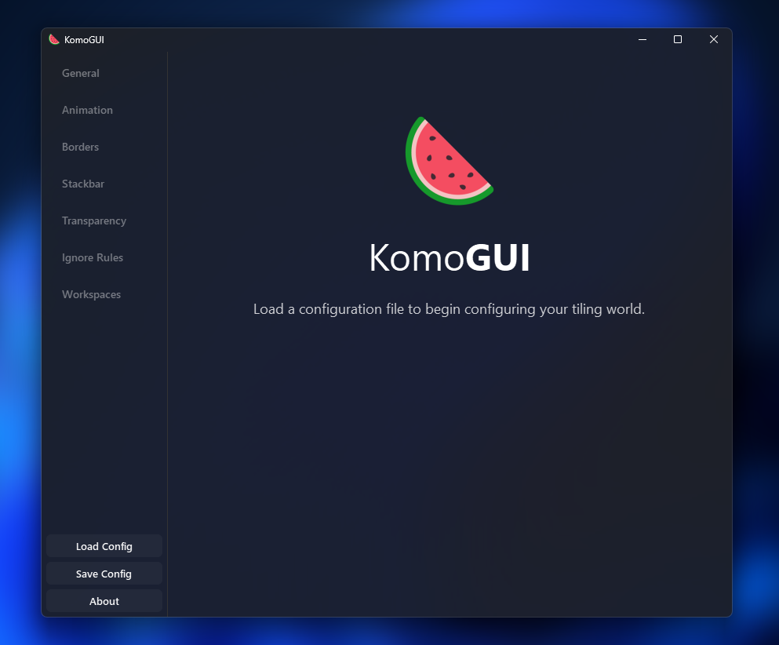

<h1 align="center">
  🍉 KomoGUI
</h1>

<p align="center">
  KomoGUI is an application that provides a graphical user interface to configure the Komorebi tiling window manager, making it easier to customize and manage your desktop environment. 
</p>

<div align="center"> 

  <a href="https://opensource.org/licenses/MIT"></a>
  <a href="https://github.com/amnweb/komogui"></a>
  <a href="https://github.com/amnweb/komogui/issues"></a>
  <a href="https://github.com/amnweb/komogui/releases"></a>
  <a href="https://github.com/amnweb/komogui/releases/latest"></a>
  <a href="https://discord.gg/Db6t9bUnQn" title="Discord"></a>

</div>



## Installation

### Winget
Install the latest version using:
``` pwsh
winget install --id AmN.KomoGUI
``` 

### .msi Installer
Download the latest installer from the [Releases](https://github.com/amnweb/komogui/releases) page and run installer to install the application. 

### portable
Download the latest portable version from the [Releases](https://github.com/amnweb/komogui/releases) page and extract the contents to a folder of your choice.

## Usage

Once installed or extracted, run the application, when you first run the application click  on the load button to load the current configuration of Komorebi, then you can start customizing your desktop environment.

> **Note:**
> The application can process the simple rules of Komorebi config file, for more advanced configurations you may need to edit the configuration file manually or wait for future updates.

> **Warning:** 
> The application is still in development and may contain bugs, please report any issues you encounter. Please backup backup your Komorebi configuration before using the application.
